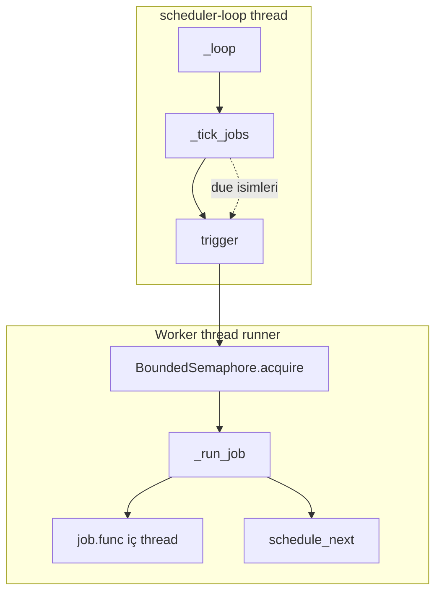
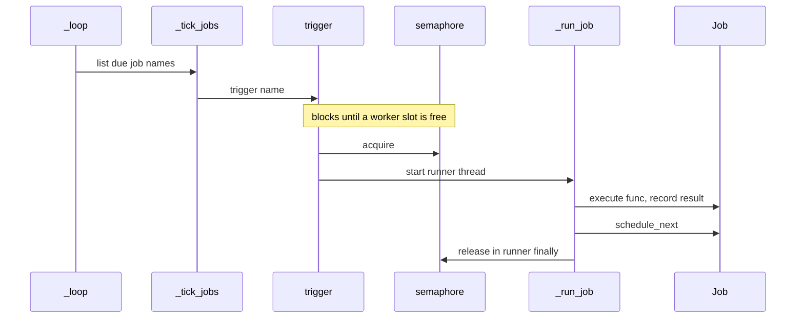

# Custom Python Scheduler

Bu depo, **tek bir Python süreci içinde** çalışan; görevleri kayıt altına alan, zamana bağlayan ve gerektiğinde **paralel çalıştıran** hafif bir zamanlayıcıdır. **Üçüncü parti kütüphane gerektirmez** — yalnızca standart kütüphane (`threading`, `dataclasses`, vb.) kullanılır.

Bu doküman hem **ne işe yaradığını** hem de **nasıl düşündüğünü** anlatır; böylece projeyi başka ortamlara taşırken veya davranışı değiştirirken doğru varsayımlarla hareket edebilirsiniz.

---

## İçindekiler

1. [Ne zaman kullanılır?](#ne-zaman-kullanılır)
2. [Temel kavramlar](#temel-kavramlar-tick-interval-cron)
3. [Mimari özeti](#mimari-özeti)
4. [İş yaşam döngüsü](#iş-yaşam-döngüsü)
5. [Eşzamanlılık ve semafor](#eşzamanlılık-ve-semafor)
6. [Cron dili (bu projedeki anlamı)](#cron-dili-bu-projedeki-anlamı)
7. [API referansı (özet)](#api-referansı-özet)
8. [Gözlemlenebilirlik](#gözlemlenebilirlik)
9. [Sınırlamalar ve bilinen tasarım seçimleri](#sınırlamalar-ve-bilinen-tasarım-seçimleri)
10. [Kurulum ve çalıştırma](#kurulum-ve-çalıştırma)
11. [Örnekler ve testler](#örnekler-ve-testler)

---

## Ne zaman kullanılır?

| Uygun senaryo | Daha az uygun senaryo |
|---------------|------------------------|
| Uzun süre ayakta kalan bir **daemon / servis** içinde periyodik işler | Uygulama çoğu zaman **kapalı**; OS seviyesinde kesin saatte tetik (`cron`, systemd timer, Windows Görev Zamanlayıcısı) daha uygun olabilir |
| İş mantığı ve zamanlama **aynı süreçte** kalsın | Çok hassas **alt-milisaniye** zamanlama veya ağır **CPU paralelliği** (GIL sınırları) |
| Harici bağımlılık istemiyorsunuz | Hazır bir **iş kuyruğu / Celery / APScheduler** ekosistemine tam entegrasyon şart |

Özet: Bu zamanlayıcı **süreç içi** bir planlayıcıdır; işletim sisteminin kendi zamanlayıcısının yerine geçmez, onunla birlikte de kullanılabilir (örneğin OS yalnızca süreci başlatır, detay bu kodda kalır).

---

## Temel kavramlar: tick, interval, cron

Üç farklı “zaman ölçeği” vardır; karıştırmamak önemlidir.

### `tick` (Scheduler)

- **Ne:** Ana döngünün “ne sıklıkla uyandığını” saniye cinsinden söyler (`Scheduler(tick=1.0)` → saniyede bir tur).
- **Ne değil:** İşin kendi tekrar süresi değildir.
- **Etki:** Bir işin `_next_at` zamanı gelmiş olsa bile, tetiklenmesi **en fazla yaklaşık `tick` gecikmesiyle** gecikebilir. Örneğin `tick=30` ise, vadesi gelmiş bir iş teoride 30 saniyeye kadar bekletilebilir (bir sonraki turda görülür).

### `interval` (Job)

- **Ne:** **Cron ifadesi boşken** kullanılır: iş bir kez **başarıyla veya hata ile** bittikten sonra bir sonraki çalışma zamanı `datetime.now() + interval` saniye olarak ayarlanır.
- **Birim:** Saniye (`float`).

### `cron` (Job)

- **Ne:** Dolu string ise planlama **cron kurallarına** göre yapılır; bir sonraki tetik `next_fire(cron, şimdi)` ile hesaplanır (dakika çözünürlüğü).
- **Boş:** Sadece `interval` kullanılır.
- **Not:** `Job` oluştururken `interval` alanı **model gereği zorunludur**; cron aktifken planlamada `interval` kullanılmaz, ancak ctor için geçerli bir sayı vermeniz gerekir (ör. `3600.0`).

---

## Mimari özeti

### Bileşenler

| Modül | Rol |
|--------|-----|
| `scheduler.py` | `Scheduler`: iş defteri, ana döngü, `trigger`, semafor, kancalar, geçmiş |
| `dto.py` | `Job`, `JobResult`, durum ve `_next_at`; iş başına `RLock` ile tutarlı okuma/yazma |
| `cron_schedule.py` | 5 alanlı cron ayrıştırma, `next_fire`, `matches` |

### Veri akışı (yüksek seviye)



- **Ana döngü thread’i:** Sadece “kim due?” diye bakar ve `trigger` çağırır.
- **`trigger`:** Önce havuzda yer açana kadar **semafor bekler**, sonra `_run_job` için kısa ömürlü bir thread başlatır.
- **`_run_job`:** Gerçek fonksiyonu (timeout için) ayrı bir iç thread’de çalıştırır; bitince sonucu kaydeder ve `schedule_next` ile bir sonraki zamanı yazar.

Detaylı akış (tek tur; her `tick` tekrarlanır — GitHub Mermaid çakışmasın diye katılımcı adı `Loop` kullanılmaz, `loop` anahtar kelimesiyle karışıyordu):



---

## İş yaşam döngüsü

1. **`add(Job)`** — İş sözlüğe konur. Cron doluysa `Job.__post_init__` ilk `_next_at` değerini ayarlar.
2. **`is_due()`** — `enabled` ve `now >= _next_at` ise tetiklenmeye adaydır.
3. **`trigger` → `_run_job`** — Çift çalışmayı önlemek için iş **RUNNING** işaretlenir; fonksiyon çalışır.
4. **Başarı veya hata** — `JobResult` geçmişe yazılır; ilgili kanca çağrılır.
5. **`schedule_next`** — `max_runs` dolmadıysa bir sonraki `_next_at` güncellenir; dolduysa iş **devre dışı** bırakılabilir.

Durumlar kabaca: `PENDING` ↔ çalışıyorken `RUNNING` → sonuç `SUCCESS` / `FAILED` → planlama sonrası tekrar `PENDING` (veya kapatılmış).

---

## Eşzamanlılık ve semafor

- **`max_workers`:** `threading.BoundedSemaphore(max_workers)` ile aynı anda en fazla bu kadar **`_run_job` yürütmesi** “havuzda” tutulur.
- **`trigger` içinde bekleme:** Slot doluysa `acquire` **bloklar**; böylece havuz doluyken gereksiz yığılma yerine kontrollü bekleme oluşur. Slot boşalınca sıradaki `trigger` ilerler.
- **Aynı iş adı:** Aynı iş zaten `RUNNING` iken ikinci bir çalıştırma erken çıkabilir (uyarı logu); semafor yine serbest bırakılır.

Bu model **I/O beklemeli** veya kısa süreli görevler için uygundur. Saf CPU işlerinde Python **GIL** nedeniyle gerçek paralellik sınırlı kalır; ağır CPU için çok iş parçacığı beklemek yerine süreç modelini gözden geçirmek gerekir.

---

## Cron dili (bu projedeki anlamı)

- **Biçim:** Beş alan, boşlukla ayrılmış:  
  `dakika saat gün ay haftanın_günü`
- **Örnekler:**

  | İfade | Anlam (bu uygulama) |
  |--------|----------------------|
  | `0 9 * * 1` | Her Pazartesi 09:00 (dakika hassasiyeti) |
  | `0 11 * * *` | Her gün 11:00 |
  | `0 9 1 * *` | Her ayın 1’i 09:00 |
  | `*/15 * * * *` | Her 15 dakikada bir |

- **Haftanın günü:** `0` ve `7` Pazar; `1` Pazartesi … `6` Cumartesi.
- **Desteklenen parça kalıpları:** `*`, tek sayı, `1,3,5`, `9-17`, `*/adım` (tam aralıkta adım).
- **Önemli:** Ayın günü (`dom`) ve haftanın günü (`dow`) **ikisi birden** doluysa bu sürümde eşleşme **AND** ile yapılır (klasik cron’un bazı yorumlarından farklı olabilir). Tek alan kullanmak en öngörülebilir sonucu verir.
- **Zaman dilimi:** `datetime.now()` ile **yerel / naive** zaman; IANA timezone desteği yoktur.

---

## API referansı (özet)

### `Scheduler`

| Parametre / üye | Açıklama |
|-----------------|----------|
| `tick` | Ana döngü periyodu (saniye). Küçük = daha sık “due” taraması, biraz daha CPU uyarısı. |
| `max_workers` | Eşzamanlı iş yürütme üst sınırı (semafor). |
| `add(job)` | İş ekler; aynı `name` varsa `False`. |
| `remove(name)` | İşi siler. |
| `activate` / `deactivate` | `Job.enabled` üzerinden aç/kapa. |
| `start(block=False)` | Arka plan döngü thread’ini başlatır. `block=True` döngü thread’inde bloklanır (nadiren). |
| `stop(join_timeout=...)` | Döngüyü durdurur; thread join süresi sınırlanabilir. |
| `trigger(name)` | Plan dışı manuel tetik; semafor + `_run_job`. |
| `on_success(fn)` / `on_failure(fn)` | `JobResult` alır; liste kopyası ile güvenli çağrı. |

### `Job`

| Alan | Açıklama |
|------|-----------|
| `name` | Benzersiz anahtar (sözlükte). |
| `func` | Argümansız çağrılan callable. |
| `interval` | Cron yokken tekrar aralığı (saniye); cron varken ctor için gerekli, planlamada cron kullanılır. |
| `cron` | İsteğe bağlı 5 alanlı ifade. |
| `timeout` | `> 0` ise iç iş için saniye cinsinden üst sınır; `<= 0` sınırsız bekleme. |
| `max_runs` | `> 0` ise bu kadar tamamlanan çalıştırmadan sonra iş kapatılabilir. |

---

## Gözlemlenebilirlik

- **`status()`** — Her iş için `monitoring_row()`: isim, cron veya interval metni, `enabled`, durum, çalışma sayısı, tahmini `next_in` saniye.
- **`history(name=None, limit=20)`** — Son kayıtlar; `name` verilirse önce süzülür, sonra son `limit` kayıt alınır (iş adına göre “son N sonuç” davranışı).

Loglar `logging` ile **INFO** seviyesinde; üretimde seviye ve format ortamınıza göre ayarlanabilir.

---

## Sınırlamalar ve bilinen tasarım seçimleri

1. **Süreç ömrü:** Scheduler thread’i durunca yeni tetik yok; süreç öldüğünde zamanlama da durur.
2. **Tick gecikmesi:** Tetikler “tam saniyede” değil; en fazla ~bir `tick` kadar kayabilir.
3. **Cron çözünürlüğü:** Dakika; saniye bazlı cron yok.
4. **`get_scheduler()`:** Global tekil örnek; testlerde sıfırlamak gerekebilir (`src.scheduler._default_scheduler = None`).
5. **Dağıtık sistem:** Tek süreç; ölçekleme veya çoklu makine koordinasyonu bu paketin kapsamı dışındadır.

---

## Kurulum ve çalıştırma

**Gereksinim:** Python **3.10+**

```bash
git clone <repo-url>
cd custom-python-scheduler
python3 -m venv .venv
source .venv/bin/activate   # Windows: .venv\Scripts\activate
```

Projeyi paket olarak yüklemek şart değil; geliştirme için kök dizinde:

```bash
export PYTHONPATH=.
```

veya her komutta:

```bash
PYTHONPATH=. python ...
```

### Minimal çalışan örnek

```python
import time
from src import Job, Scheduler

def iş():
    print("çalıştı")

s = Scheduler(tick=1.0, max_workers=2)
s.add(Job(name="örnek", func=iş, interval=10.0))
s.start()
try:
    time.sleep(5)
finally:
    s.stop()
```

---

## Örnekler ve testler

### `examples/` dizini

| Dosya | Ne gösterir? |
|--------|----------------|
| `interval_and_loop.py` | `tick` + `interval` ile döngü |
| `manual_trigger.py` | Döngü olmadan `trigger` |
| `hooks_and_limits.py` | Kancalar ve `max_runs` |
| `cron_expression.py` | `parse_cron` / `next_fire` |
| `decorator_global_scheduler.py` | `@schedule` ve varsayılan scheduler |

```bash
PYTHONPATH=. python examples/interval_and_loop.py
```

### Testler

```bash
PYTHONPATH=. python -m unittest discover -s tests -v
```

- `tests/test_cron_schedule.py` — Cron ayrıştırma ve `next_fire`
- `tests/test_scheduler.py` — Tetikleme, döngü, kancalar, bağlam yöneticisi, dekoratör

---

## Proje yapısı

```
custom-python-scheduler/
├── README.md
├── src/
│   ├── __init__.py
│   ├── dto.py
│   ├── cron_schedule.py
│   └── scheduler.py
├── examples/
└── tests/
```

---

Bu README, mevcut kodla uyumlu olacak şekilde yazılmıştır; davranış değişikliklerinde ilgili bölümleri güncellemeyi unutmayın.
